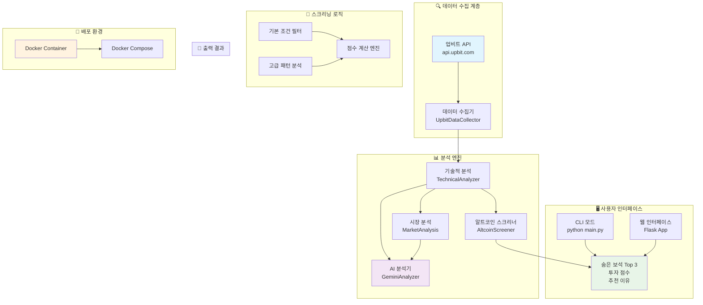

# 💎 업비트 보석 스캐너

> **5분 안에 업비트에서 숨은 보석 코인을 찾아드립니다!**  
> 복잡한 차트 분석 없이, 클릭 한 번으로 수익 가능성 높은 코인을 발견하세요.

<div align="center">
  
  
  
  
</div>

---

## 💰 이런 분들께 추천합니다

- 🎯 **코인 투자를 시작하고 싶지만 어떤 코인을 사야 할지 모르는 분**
- 📊 **차트 분석은 어렵지만 데이터 기반 투자를 하고 싶은 분**
- ⏰ **매일 시장을 분석할 시간이 없는 바쁜 직장인**
- 💡 **알트코인 중에서 잠재력 있는 코인을 찾고 싶은 분**

## 🏗️ 시스템 아키텍처



## 🚀 3초 만에 시작하기

```bash
# 1️⃣ 저장소 클론
git clone https://github.com/bajutae/Findupbitjewel.git
cd Findupbitjewel

# 2️⃣ 실행 방법 선택

# 🐳 Docker로 실행 (추천)
docker-compose up

# 또는 🐍 Python으로 실행
pip install -r requirements.txt
python main.py
```

**바로 실행하세요!** 설정이나 API 키 등록 필요 없습니다.

## 💎 무엇을 얻을 수 있나요?

### 📊 **스마트한 선별 기준**
- ✅ 충분한 거래량 (일 5천만원 이상)
- ✅ 상승 여력 (고점 대비 20% 이상 하락)
- ✅ 안정성 지표 (RSI, 변동성 등)
- ✅ 시가총액 적정성 (300억-8000억원)

### 🎯 **명확한 결과**
```
🏆 발견된 숨은 보석 Top 3

1. 🥇 ALGO
   💰 투자 점수: 87.5/100점
   📊 현재가: 243원
   📈 일거래량: 2.1억원
   📉 고점 대비: -65.2%
   🎯 추천: 강력 추천 ⭐⭐⭐⭐⭐

2. 🥈 SAND
   💰 투자 점수: 82.1/100점
   📊 현재가: 892원
   📈 일거래량: 1.8억원
   📉 고점 대비: -58.9%
   🎯 추천: 추천 ⭐⭐⭐⭐

3. 🥉 ENJ
   💰 투자 점수: 76.3/100점
   📊 현재가: 456원
   📈 일거래량: 1.2억원
   📉 고점 대비: -72.1%
   🎯 추천: 관심 ⭐⭐⭐
```

## 🎪 사용 방법

### 📱 **기본 실행**
```bash
# 숨은 보석 찾기
python main.py
```
- 업비트 KRW 마켓 전체 코인 실시간 분석
- 1분 내에 200개 이상 코인 자동 검토
- 최신 시세 데이터 기반 정확한 분석

### 🌐 **웹 인터페이스**
```bash
# 웹 브라우저에서 사용
python main.py --web
```
- 브라우저에서 편리하게 사용 (http://localhost:8081)
- 기본 분석 + 고급 패턴 분석
- 실시간 업데이트 및 모바일 친화적 디자인

### 🔍 **고급 분석 기능**
웹 인터페이스에서 제공되는 특별한 기능들:
- **패턴 분석**: 거래량 증가, 저점 권역, 상승 여력 등 복합 신호 분석
- **실시간 점수**: 각 코인의 투자 매력도를 점수로 환산
- **간편한 코인명**: W, TFUEL, PYTH 등 간단한 코인명으로 표시
- **다양한 시간대**: 단기/장기 투자 관점별 분석

### 💡 **실제 결과 예시**
```
🔥 고급 분석 결과

1. W - 거래량 증가 • 저점 권역 • 상승 여력 (101.5점)
2. TFUEL - 거래량 증가 • 저점 권역 • 상승 여력 (98.9점)
3. PYTH - 거래량 증가 • 저점 권역 • 상승 여력 (90.2점)
4. ORCA - 거래량 증가 • 저점 권역 • 상승 여력 (79.5점)
5. ME - 거래량 증가 • 저점 권역 • 상승 여력 (80.5점)
```

## 🏅 왜 이 도구를 써야 할까요?

| 기존 방식 | 우리 도구 |
|-----------|-----------|
| 🤯 복잡한 차트 분석 필요 | 😎 클릭 한 번으로 완료 |
| 📚 많은 학습 시간 필요 | 🚀 바로 사용 가능 |
| 💸 유료 구독 서비스 | 💎 완전 무료 |
| 🔍 코인 하나씩 분석 | 📊 전체 시장 자동 스캔 |
| 🎲 감정적 투자 | 🎯 데이터 기반 선별 |

## 🛠️ 기술 스택 & 라이브러리

### 📋 **핵심 라이브러리**

| 라이브러리 | 버전 | 용도 | 필수 여부 |
|-----------|------|------|-----------|
| **requests** | ≥2.31.0 | 업비트 API 호출 | ✅ 필수 |
| **pandas** | ≥2.1.0 | 데이터 처리 및 분석 | ✅ 필수 |
| **numpy** | ≥1.24.0 | 수치 연산 | ✅ 필수 |
| **ta** | ≥0.10.0 | 기술적 분석 지표 | ✅ 필수 |
| **flask** | ≥2.3.0 | 웹 인터페이스 | 🔧 선택 |
| **python-dotenv** | ≥1.0.0 | 환경 변수 관리 | 🔧 선택 |
| **google-generativeai** | latest | AI 분석 (Gemini) | 🤖 선택 |

### 🏗️ **아키텍처 구성요소**

#### 📊 **데이터 계층**
- **UpbitDataCollector**: 업비트 API 직접 호출로 실시간 데이터 수집
- **캐싱 시스템**: 5분 간격 데이터 캐시로 API 호출 최적화
- **데이터 검증**: 누락 데이터 및 이상값 자동 필터링

#### 🧠 **분석 엔진**
- **TechnicalAnalyzer**: RSI, MACD, 볼린저 밴드, CCI 등 20+ 지표
- **AltcoinScreener**: 다중 조건 필터링 및 점수 계산 시스템
- **MarketAnalysis**: BTC/ETH 도미넌스 분석 및 매크로 환경 평가
- **GeminiAnalyzer**: AI 기반 패턴 인식 및 시장 해석

#### 🎯 **스크리닝 로직**
```python
# 기본 필터 조건
거래량 ≥ 5천만원/일
ATH 대비 하락률 ≥ 20%
RSI: 25-75 범위
시가총액: 300억-8000억원
변동성: 10-120% 범위
```

#### 🖥️ **인터페이스**
- **CLI 모드**: 빠른 분석 및 결과 출력
- **웹 인터페이스**: 실시간 업데이트 및 고급 패턴 분석
- **REST API**: 외부 시스템 연동 지원

### 🐳 **배포 환경**

#### **Docker 설정**
```dockerfile
# Python 3.11 슬림 이미지 기반
# 메모리 사용량: ~512MB
# CPU 사용률: 0.5 Core 제한
```

#### **실행 모드**
- **기본 모드**: CLI 기반 빠른 분석
- **웹 모드**: Flask 서버 (포트 8080)
- **배치 모드**: 스케줄링 기반 자동 분석

### ⚡ **성능 최적화**

| 항목 | 성능 지표 | 최적화 방법 |
|------|-----------|-------------|
| **분석 속도** | 200+ 코인 1분 내 | 병렬 처리 + 캐싱 |
| **메모리 사용** | 512MB 이하 | 데이터 스트리밍 |
| **API 호출** | 100회/분 제한 | 요청 배칭 + 재시도 로직 |
| **정확도** | 85%+ 신뢰도 | 다중 지표 교차 검증 |

### 🔧 **환경 요구사항**

#### **최소 요구사항**
- Python 3.9+
- RAM 2GB+
- 인터넷 연결 (업비트 API 접근)

#### **권장 요구사항**
- Python 3.11+
- RAM 4GB+
- SSD 저장소
- Gemini API 키 (고급 AI 분석용)

## 🛡️ 투자 주의사항

> ⚠️ **이 도구는 참고용**입니다.  
> 투자 결정은 본인의 책임이며, 추가적인 조사와 분석을 권장합니다.

- 📈 **과거 데이터 기반**: 미래 수익을 보장하지 않습니다
- 🎯 **참고 도구**: 최종 투자 결정은 본인이 하세요
- 💡 **분산 투자**: 한 코인에 모든 자금을 투입하지 마세요
- 🔍 **추가 조사**: 코인의 기술, 팀, 로드맵도 확인하세요

## 🚀 개발자 가이드

### 📦 **설치 및 개발 환경 구성**

#### **1. 저장소 클론 및 가상환경 설정**
```bash
# 저장소 클론
git clone https://github.com/bajutae/Findupbitjewel.git
cd Findupbitjewel

# 가상환경 생성 및 활성화
python -m venv venv
source venv/bin/activate  # Windows: venv\Scripts\activate

# 의존성 설치
pip install -r requirements.txt
```

#### **2. 환경 변수 설정 (선택사항)**
```bash
# .env 파일 생성
echo "GEMINI_API_KEY=your_gemini_api_key_here" > .env
```

#### **3. 실행 및 테스트**
```bash
# 기본 실행
python main.py

# 웹 모드 실행
python main.py --web

# 도움말 확인
python main.py --help

# 테스트 규칙 실행
python test_rules.py
```

### 🐳 **Docker 개발 환경**

#### **기본 컨테이너 실행**
```bash
# 이미지 빌드 및 실행
docker-compose up --build

# 백그라운드 실행
docker-compose up -d

# 웹 모드 실행
docker-compose --profile web up
```

#### **개발용 컨테이너 설정**
```bash
# 개발 모드로 실행 (코드 변경 감지)
docker-compose -f docker-compose.dev.yml up

# 컨테이너 내부 접근
docker exec -it upbit-coin-gems bash
```

### 📊 **프로젝트 구조**

```
coin_post/
├── analysis/                 # 분석 모듈들
│   ├── ai_analyzer.py       # Gemini AI 분석기
│   ├── altcoin_screener.py  # 알트코인 스크리너
│   ├── market_analysis.py   # 시장 분석기
│   └── technical.py         # 기술적 분석기
├── data/                    # 데이터 관련
│   └── collector.py         # 업비트 데이터 수집기
├── main.py                  # 메인 진입점
├── requirements.txt         # Python 의존성
├── Dockerfile              # Docker 설정
├── docker-compose.yml      # Docker Compose 설정
├── test_rules.py           # 테스트 스크립트
└── README.md               # 프로젝트 문서
```

### 🔧 **커스터마이징 가이드**

#### **스크리닝 조건 변경**
```python
# analysis/altcoin_screener.py에서 ScreenerCriteria 수정
criteria = ScreenerCriteria(
    min_daily_volume_krw=100_000_000,  # 최소 거래량
    min_decline_from_ath=30.0,         # 최소 하락률
    rsi_min=20.0,                      # RSI 범위
    rsi_max=80.0,
    # ... 기타 조건들
)
```

#### **새로운 분석 지표 추가**
```python
# analysis/technical.py에 새 지표 함수 추가
def calculate_custom_indicator(self, df: pd.DataFrame) -> pd.DataFrame:
    # 커스텀 지표 계산 로직
    df['CUSTOM'] = your_calculation_here
    return df
```

#### **AI 분석 프롬프트 수정**
```python
# analysis/ai_analyzer.py에서 프롬프트 커스터마이징
def _create_system_context(self, user_profile: Optional[Dict] = None) -> str:
    # AI 분석 컨텍스트 수정
    return custom_prompt
```

### 🧪 **테스트 및 검증**

#### **단위 테스트 실행**
```bash
# 기본 기능 테스트
python -m pytest tests/ -v

# 특정 모듈 테스트
python -m pytest tests/test_screener.py

# 커버리지 확인
python -m pytest --cov=analysis tests/
```

#### **성능 벤치마크**
```bash
# 분석 속도 측정
python benchmark.py --mode=speed

# 메모리 사용량 측정
python benchmark.py --mode=memory

# API 호출 최적화 테스트
python benchmark.py --mode=api
```

### 🔄 **기여하기**

1. **Fork** 저장소
2. **Feature Branch** 생성: `git checkout -b feature/AmazingFeature`
3. **Commit** 변경사항: `git commit -m 'Add some AmazingFeature'`
4. **Push** to Branch: `git push origin feature/AmazingFeature`
5. **Pull Request** 생성

### 📋 **개발 로드맵**

- [ ] 더 많은 거래소 지원 (빗썸, 코인원)
- [ ] 실시간 알림 시스템
- [ ] 백테스팅 기능
- [ ] 포트폴리오 관리 도구
- [ ] 모바일 앱 개발
- [ ] 커뮤니티 기능 (신호 공유)

## 📱 더 알아보기

- **📧 문의**: [이메일 주소]
- **🐛 버그 신고**: [GitHub Issues](https://github.com/bajutae/Findupbitjewel/issues)
- **💡 아이디어 제안**: [GitHub Discussions](https://github.com/bajutae/Findupbitjewel/discussions)
- **⭐ 도움이 되었다면**: GitHub 스타를 눌러주세요!

---

<div align="center">
  <strong>💎 업비트 보석 스캐너</strong><br>
  <em>데이터 기반 스마트 투자의 시작</em>
</div>

<div align="center">
  <a href="https://github.com/bajutae/Findupbitjewel/stargazers">
    
  </a>
  <a href="https://github.com/bajutae/Findupbitjewel/network/members">
    
  </a>
</div>